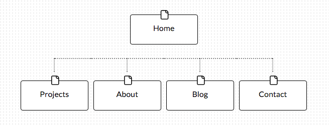

#Reflection for 2.3 Introduction to Design and Site Planning

##What are the 6 Phases of Web Design?
  - **Information Gathering.** This is probably the most important phase. If you don't know what your client's goals are or who the audience is, you might end up with an attractive website, but it likely won't speak to your users.
  - **Planning.** Before moving on to the design phase it's essential to organize and prioritize all of the information you gathered to determine the site structure and flow.
  - **Design.** Now that you have a better understanding of who you are designing for and what your goals are, you can use that knowledge to make thoughtful decisions about how to create mock-ups of the website.
  - **Development.** This is the step in which the functioning website is created.
  - **Testing and Delivery.** It's essential to thoroughly test your website for errors on multiple platforms and browsers to ensure that it functions correctly no matter how a user accesses it.
  - **Maintenance.** Businesses change, web standards change, and your website needs to change with them. Maintenance is the key to making sure your website stays relevant and successful.

##What is your site's primary goal or purpose? What kind of content will your site feature?
I would say that delivering a compelling story about who you are as a developer and, just as importantly, a person, is the primary goal of this type of website. You could compare the action of contacting the site owner with an ecommerce checkout, but I think it's unlikely that a potential client or hiring manager is going to stumble upon your website through search or by accident. It's more likely that someone will have recommended you to a potential client or a hiring manager will already have your resume in hand. Looking at your website will be your second or third touch-point with them, so your goal is to make them see that you are good at and passionate about what you do and that you are someone they'd like to work with.
Given that, I think that a good and naturally posed photo would be an excellent addition to the website. I would also emphasize samples of work and a brief introduction to who you are.

##What is your target audience's interests and how do you see your site addressing them?
The target audience will ideally be looking to hire you! You can address this by making your site reflect your personality and making it easy to discover and understand key content like work samples and information about yourself.

##What is the primary "action" the user should take when coming to your site? Do you want them to search for information, contact you, or see your portfolio? It's OK to have several actions at once, or different actions for different kinds of visitors.
This isn't as concrete as a click or search, but someone who's looking to hire you probably doesn't have a lot of time. So the primary action would be for them to spend some time on your website exploring your work and personal information. You'll need to make an instant impression with your homepage to pique their interest. Your blog might attract a different type of user. One that isn't interested in hiring you, but may help to establish your legitimacy in your field by interacting with and responding to blog posts or linking to your website.

##What are the main things someone should know about design and user experience?
There is no standard template for design because every project has different goals and audiences. So one of the main things to understand is that design isn't just about visuals, it's about accomplishing a goal. Google has laid out their "Material Design" guidelines for anyone to see: [https://design.google.com/resources/](https://design.google.com/resources/). It's really interesting to look through and this type of resource can give you a lot of insight into how a successful company approaches design. But that doesn't mean it will work for you.
Usability is important to user experience design (UX), but UX is primarily about how the customer reacts to your design, website, or interface on an emotional level. Much like design in general, there is no standard way to implement UX because goals and audiences are so varied. Also, traditional metrics like click-throughs, page views, and conversion rates can't tell the whole story when it comes to UX, so it's necessary to seek out data from other sources like surveys and focus groups to get a better idea if what you are doing is working.

##What is user experience design and why is it valuable?
User experience design is the process of optimizing an interface so that the user has a better emotional experience when interaction with it. Getting your users to connect with your website, software, etc. and feel positive about it can have a significant influence on their experience. It might increase the likelihood of a user completing a purchase. The user might feel more connected to your brand and will be more likely to buy from or use your services in the future.Think about it in terms of buying a car. You can do all the research in the world and know which car you think you want, But once you sit in it and drive it, you may completely change your mind based on how it makes you feel.

##Which parts of the challenge did you find tedious?
I generally like design and have studied it in the past, so there wasn't a lot here that I found tedious. I felt some of the reflection questions were a bit redundant, but in hindsight, I could have formatted my writing differently and answered made connections between some of the closely related questions.