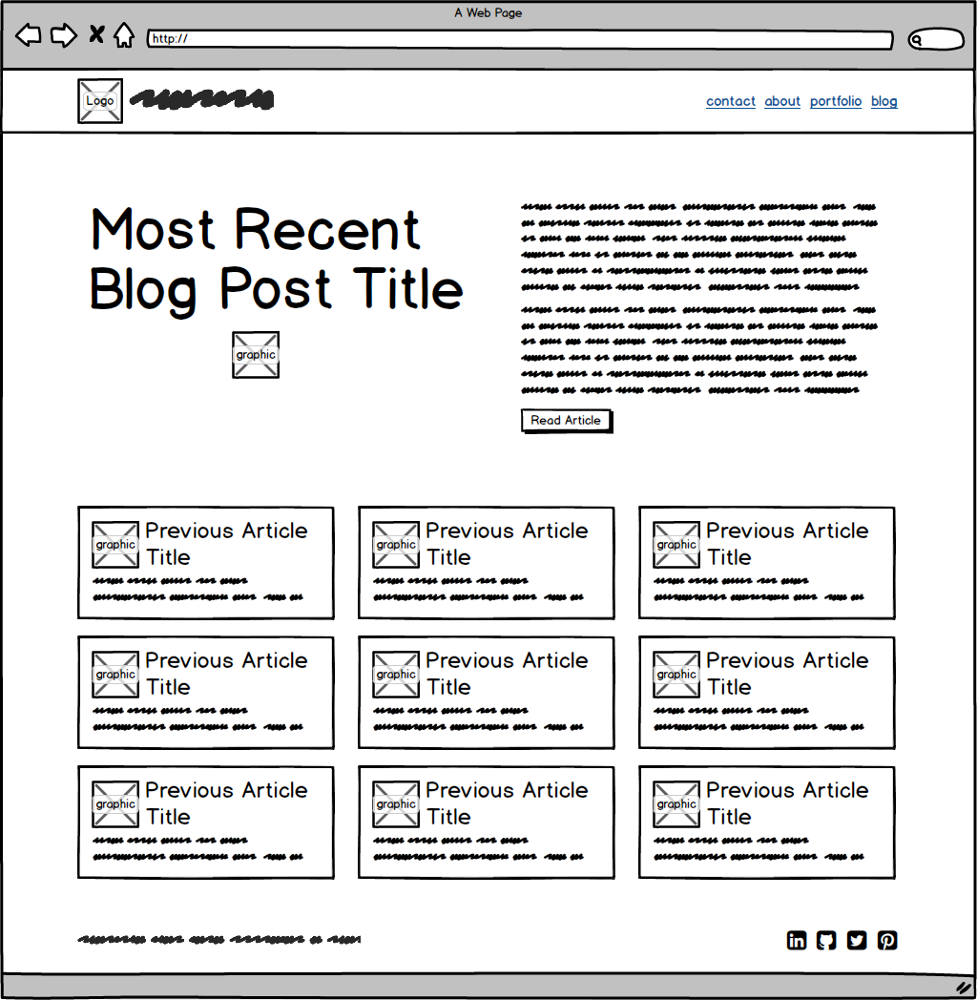

#Reflection for Module 2.4 Wireframing

##What is a wireframe?
A wireframe is like a blueprint for a screen or web page design. It is an initial version of your design that is stripped of details like color.

##What are the benefits of wireframing?
A wireframe allows you to experiment with your basic design elements more quickly. If you decide a layout isn't working you can always try another. It's also helpful to view the information hierarchy of your elements and make sure you're emphasizing what is most important and developing a natural flow to your layout and navigation. It also gives you a basis to begin coding because the base elements of the page are already there.

##Did you enjoy wireframing your site?
It was a very good exercise for me. I enjoyed the result and what I learned from it. I usually want to jump right in and start designing more complex elements, but that usually leads to a less cohesive design. It was good to walk through this process and see how helpful it can be.

##Did you revise your wireframe or stick with your first idea?
I revised it three times.

##What questions did you ask during this challenge? What resources did you find to help you answer them?
After reading through the information in release 0 I wanted to see some examples of similar websites. There a ton of blog articles out there on sites like [Mashable](http://www.mashable.com) and [Onextrapixel](http://www.onextrapixel.com) that have good examples. I also wondered what the optimal width would be for my website. There are many different opinions, but in the end I opted for 960 pixels since it has been the standard for awhile now. I also wondered what the best way to start wireframing would be for me. I found this article about using thumbnail sketches as a starting point on [designshack.net](http://designshack.net/articles/inspiration/close-photoshop-and-grab-a-pencil-the-lost-art-of-thumbnail-sketches/) and it seemed like a good way to get a number of ideas out quickly.

##Which parts of the challenge did you enjoy and which parts did you find tedious?
I enjoyed the process of learning to consider basic information hierarchy and flow first. I haven't really done any wireframing before though, so even though I used Balsamiq, there was a bit of a learning curve with a new tool that can be frustrating.

