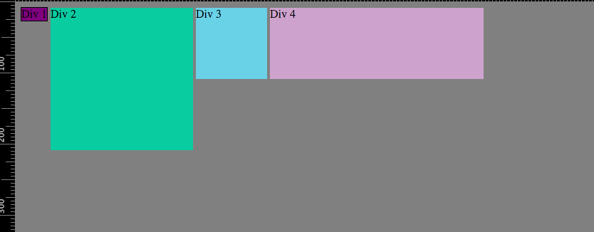

#Reflection for 3.4 Chrome DevTools

**How can you use Chrome's DevTools inspector to help you format or position elements?**
Chrome's DevTools give you the ability to edit the CSS formatting and positioning of elements live in the browser. Because CSS can be a trial an error process (particularly for a beginner), this is a very helpful tool because you can quickly see how changing or adding CSS to an element will affect your page without having to edit your original CSS file, save, and refresh the page.

**How can you resize elements on the DOM using CSS?**
You just need to click on the element in the DOM and change the sizing in the CSS styles pane.

**What are the differences between absolute, fixed, static, and relative positioning? Which did you find easiest to use? Which was most difficult?**
* Static positioning is the default value and places the element in the normal document flow.

* Absolute positioning takes the element out of the normal document flow, leaving no space where it would have been, and allows you to position the element wherever you want using x, y coordinates relative to it's parent element.

* Relative positioning allows you to position the element relative to itself using x, y coordinates. It also reserves a space in the document flow that the element would normally occupy.

* Fixed positioning
Fixed positioning removes the element from the normal document flow and positions it in relation to the viewport. The element stays in the same position in the viewport even if the user scrolls.

**What are the differences between margin, border, and padding?**
Margin sits outside the border and allows you to define how much empty space there is around the element, but does not affect the size of the element itself. The border sits in between the margin and the padding. You can style the border in a number of different colors, looks (solid, dotted, double, etc), and combinations. Padding sits inside the border and allows you to set how much empty space is within the element. It also affects the size of the element. So if you want a div that's 300px wide with 25px of padding on the left and right, you would need to set the width to 250px.

**What was your impression of this challenge overall? (love, hate, and why?)**
We had fun with it. It was the shortest pairing session I've had because we got through it pretty quickly. There were a few things we had to look up like how to center an element with it's position set to fixed, but when we did have problems we were able to find the solution pretty quickly.
