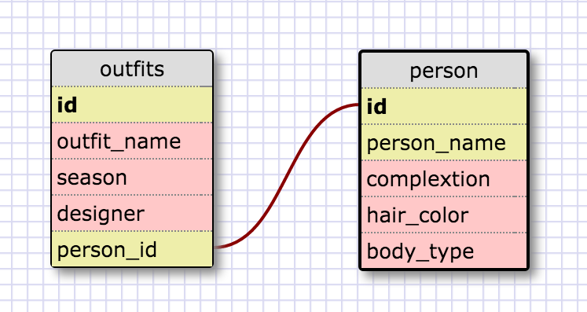

#Module 8.4 Introduction to Data Schema

1. SELECT * FROM states;
2. SELECT * FROM regions;
3. SELECT state_name, population FROM states;
4. SELECT state_name, population FROM states ORDER BY population DESC;
5. SELECT state_name FROM states WHERE region_id = 7;
6. SELECT state_name, population_density FROM states WHERE population_density > 50 ORDER BY population_density ASC;
7. SELECT state_name FROM states WHERE population > 1000000 AND population < 1500000;
8. SELECT state_name, region_id FROM states ORDER BY region_id ASC;
9. SELECT region_name FROM regions WHERE region_name LIKE '%central%';
10. SELECT regions.region_name, states.state_name FROM regions INNER JOIN states ON regions.id=states.region_id
ORDER BY states.region_id ASC;

##Reflection
**What are databases for?**
Databases are intended for storing sets of related information. They offer more flexibility and depth for large volumes of information than data structures like arrays and hashes do.

**What is a one-to-many relationship?**
A one-to-many relationship is when you have a column in your database that is made up of a small set of values that could be stored in a separate database and accessed using a foreign key.

**What is a primary key? What is a foreign key? How can you determine which is which?**
A primary key is a unique key, typically a number, for every row in a database. A foreign key is again typically a number that is used to access information in another database. The values for the primary keys in a database should all be unique and should be in the first column of the database. It should also be called "id." A foreign key will have the same value assigned to multiple rows in a database.

**How can you select information out of a SQL database? What are some general guidelines for that?**
You can select information from a SQL database using SELECT statements. A typical SELECT statement will look something like this:
SELECT column_name1, column_name2 FROM database_name WHERE [conditional statement];
For naming conventions, you should use snake case instead of camel case.