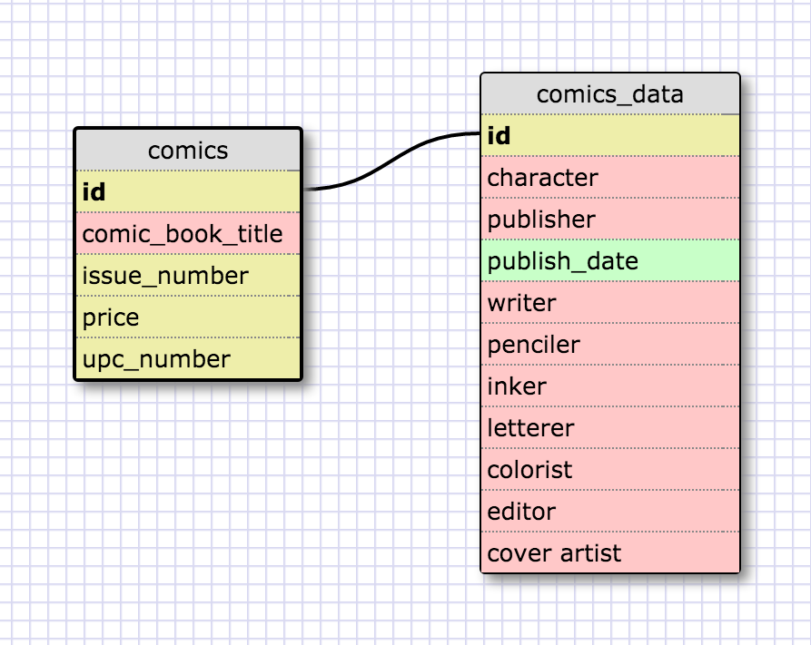
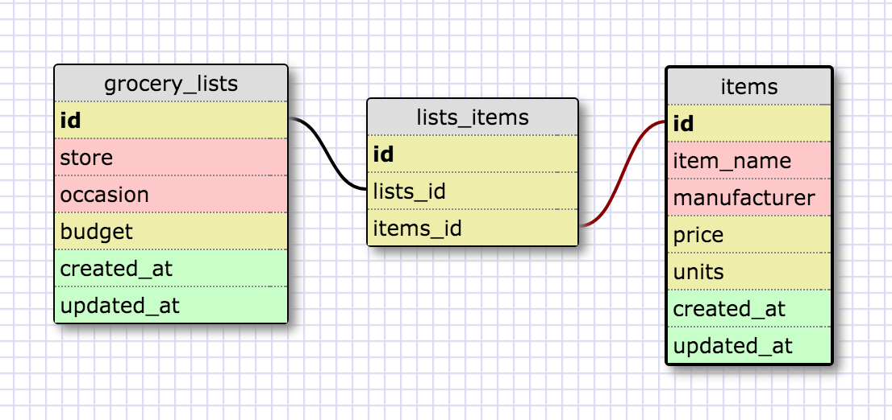

#Module 8.5 More Schemas

##One-to-one schema

I see this as a one-to-one relationship because a comic book store might have it's entire inventory in a database, but they would mainly access the data in the "comics" database. However, there would likely be a few customers who would want to know if they had comic books drawn by a certain artist or written by a specific writer. It wouldn't be that often, but it would be helpful to have that data attached to the comic book.

##Many-to-many schema

##Reflection
**What is a one-to-one database?**
A one-to-one database includes multiple databases that contain highly related content.

**When would you use a one-to-one database? (Think generally, not in terms of the example you created).**
You might create a one-to-one database if certain information will be used more frequently than other information. This keeps the size of the database that is accessed most often down. You might also use this database setup if some columns might have null values.

**What is a many-to-many database?**
A many-to-many database will have multiple databases, including a join table, that are essentially separate, but have some relationship to each other that would make it useful to be able to join data from the separate databases.

**When would you use a many-to-many database? (Think generally, not in terms of the example you created).**
You would use it when the information stored in each database is essentially separate, but there is a relationship between them that would make it helpful to be able to have them connected.

**What is confusing about database schemas? What makes sense?**
I think the hardest part is to figure out when to use one type over another. The logic makes sense in simplified examples, but it will be more difficult to gauge with some real-life situations.
